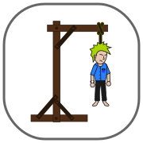
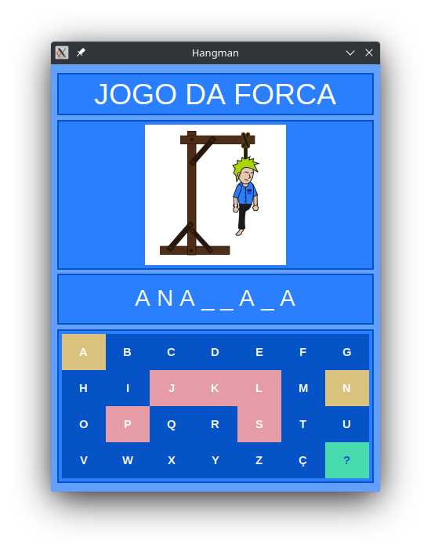

# **Hangman**
Hangman ou em português Jogo da Forca, é um jogo de adivinhação onde você deverá descobrir qual é a palavra secreta cujo é apresentada de forma aleatória dizendo apenas as suas letras existentes.
Nesse projeto em questão, você também pode contar com uma dica da palavra apresentada ao clicar no botão de interrogação, caso ache a palavra muito difícil de adivinhar.

## **Observações importantes:**
- Esse jogo foi desenvolvido em python usando a biblioteca TKinter para criar sua interface gráfica (GUI), caso tenha conhecimento e deseje testar, talvez precise instalar essa biblioteca para funcionar;
  - `pip install tk` ou `pip3 install tk`

- Outro detalhe é que estou usando um sistema Linux derivado do Ubuntu, o **Kubuntu**, e tem uma chance da interface ficar diferente em outro sistema operacional, e certamente irá precisar de alguns ajustes.

# Minha proposta pessoal nesse projeto:
Para essa aplicação a idéia é criar uma interface gráfica usando a biblioteca "Tkinter" para haver interação com o usuário de forma mais fúida e porque não, mais divertida.

Com esse projeto pretendo exercitar munhas habilidades em lógica de programação e reforçar os conhecimentos com a linguágem de programação python.

- Apesar de ter finalisado um versão funcional como desejado, ainda pretendo fazer algumas melhorias no código afim de deixar o progeto mais rico em qualidade.